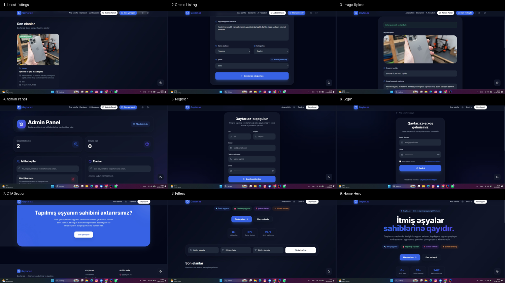

<div align="center">

# 🔍 Qaytar.az

### Lost & Found Platform for Azerbaijan



<br>


</div>

Azərbaycanda itmiş və tapılmış əşyaların paylaşılması, uyğun elanların avtomatik aşkarlanması və əşyaların sahiblərinə qaytarılmasını asanlaşdıran full-stack Lost & Found platforması.

Qaytar.az istifadəçilərin itirdikləri və ya tapdıqları əşyalar haqqında elan yaratmasına, elanları idarə etməsinə, oxşar elanları tapmasına və əşya sahibləri ilə daha sürətli əlaqə qurmasına imkan verir.

Layihənin əsas məqsədi itmiş əşyaların sahiblərinə daha qısa müddətdə çatdırılmasını təmin etmək və istifadəçilər arasında təhlükəsiz əlaqə yaratmaqdır.

---

# ✨ Əsas Xüsusiyyətlər

## 🔐 Authentication & Security

* JWT Authentication
* Access Token & Refresh Token mexanizmi
* Refresh Token Rotation
* Spring Security ilə endpoint qorunması
* Role-based Authorization
* BCrypt ilə şifrə şifrələnməsi
* Email Verification (OTP Code)
* Forgot Password & Reset Password sistemi
* Login Notification Email
* Environment Variables (.env)
* Sensitive Configuration Hidden
* İstifadəçi sessiyalarının təhlükəsiz idarə olunması

---

### 📍 Location & Smart City Detection

* HTML5 Geolocation API inteqrasiyası
* İstifadəçinin mövcud yerinin avtomatik müəyyən edilməsi
* Şəhərin avtomatik seçilməsi
* Manual şəhər seçimi dəstəyi
* Location icazəsi verilmədikdə alternativ seçim imkanı

---

## 📦 Əşya Elanları

* İtmiş əşya elanı yaratmaq
* Tapılmış əşya elanı yaratmaq
* Elanları yeniləmək
* Elanları silmək
* Öz elanlarını görüntüləmək
* Şəhərə görə filtrasiya
* Statusa görə filtrasiya
* Əşya növünə görə filtrasiya
* Əşya təsviri (Description) dəstəyi
* Pagination dəstəyi
* Şəkil əlavə etmək
* Elan detalları səhifəsi

---

## 🤝 Smart Matching System

İtmiş və tapılmış əşyaların avtomatik müqayisəsi

Şəhər və əşya növünə əsaslanan uyğunluq analizi

Yeni uyğun elan yaradıldıqda avtomatik Email Notification

Asinxron (@Async) Matching prosesi

İstifadəçi gözləmədən arxa planda uyğunluq yoxlanışı

---

## 👤 İstifadəçi İdarəetməsi

* Qeydiyyat
* Email Verification
* Giriş
* JWT Authentication
* Refresh Token mexanizmi
* Profil məlumatlarının görüntülənməsi
* Profil məlumatlarının yenilənməsi
* Profil statistikaları
* Şifrə dəyişdirmə
* Forgot Password
* Reset Password
* İstifadəçi elanlarının idarə olunması
* Dark / Light Mode dəstəyi

---

## 👑 Admin Panel

Admin istifadəçilər və elanlar üzərində tam nəzarət imkanına malikdir.

### Admin imkanları

* Bütün istifadəçiləri görüntüləmək
* Bütün elanları görüntüləmək
* İstənilən istifadəçini silmək
* İstənilən elanı silmək
* Öz hesabını silməyə qarşı qoruma
* Role-Based Access Control (RBAC)

### Admin Endpointləri

```http
GET    /admin/users
GET    /admin/items

DELETE /admin/users/{id}
DELETE /admin/items/{id}
```
---

## 🖼️ Şəkil Dəstəyi

* Multipart File Upload
* Şəkillərin serverdə saxlanılması
* Dinamik şəkil URL-ləri
* Şəkillərin frontenddə göstərilməsi
* Multipart Upload Validation

---

# 🏗️ Layihə Arxitekturası

Backend Layered Architecture prinsiplərinə uyğun hazırlanmışdır.

```text
Controller
    ↓
Service
    ↓
Mapper
    ↓
Repository
    ↓
PostgreSQL
```

Authentication axını:

```text
Client
    ↓
JWT Filter
    ↓
Spring Security
    ↓
Protected Endpoints
```

Layihədə aşağıdakı yanaşmalardan istifadə olunmuşdur:

DTO Pattern
Mapper Pattern
Layered Architecture
JWT Authentication
Refresh Token Strategy
Dependency Injection
Repository Pattern

---

# ⚙️ Texnologiyalar

## Backend

☕ Java 21

🍃 Spring Boot

🔐 Spring Security

🗄 PostgreSQL

🔑 JWT Authentication

📨 Spring Mail

📝 Lombok

✅ Jakarta Validation

⚙️ Gradle

---

## Frontend

* React
* Vite
* Axios
* React Router
* Tailwind CSS
* Lucide React Icons
* HTML5 Geolocation API
* Context API
* Protected Routes
* Role-Based UI Rendering
* Dark / Light Theme
* Responsive Design
* Admin Dashboard

---

## DevOps

* Git
* GitHub
* Docker (Development mərhələsində)

---

# 🔗 API Endpoints

## Authentication

```http
POST /auth/register
POST /auth/verify-email

POST /auth/login
POST /auth/refresh
POST /auth/logout

POST /auth/forgot-password
POST /auth/reset-password

PATCH /auth/profile
PATCH /auth/change-password

GET  /auth/profile
```

---

## Items

```http
GET    /api/items
GET    /api/items/{id}
GET    /api/items/my-items

POST   /api/items
PUT    /api/items/{id}
DELETE /api/items/{id}
```

---

## Search & Filter

```http
GET /api/items/search
GET /api/items?cityId=
GET /api/items?itemType=
GET /api/items?itemStatus=
```

---

## Cities

```http
GET  /api/cities
POST /api/cities
```

---

# 🛡️ Təhlükəsizlik

Layihədə aşağıdakı təhlükəsizlik mexanizmləri tətbiq edilmişdir:

* JWT Authentication
* Access Token & Refresh Token
* Spring Security
* Password Encryption (BCrypt)
* Protected Endpoints
* Authentication Filter Chain
* Email Verification
* Password Reset Token
* Request Validation

---

# 📈 Gələcək İnkişaf Planları

* Google Maps inteqrasiyası
* Location əsaslı yaxın elanlar
* Real-Time Notification System
* Cloud Storage Integration
* Docker Deployment
* Elasticsearch əsaslı axtarış
* Mobile Application

---

# 👨‍💻 Layihə Haqqında

Bu layihənin backend hissəsi Java və Spring Boot texnologiyalarından istifadə edilərək hazırlanmışdır.

Layihə real dünya ssenarisinə uyğun olaraq JWT Authentication, Refresh Token Rotation, Email Verification, Password Recovery, Profile Management, Role-Based Authorization, Admin Dashboard, Multipart File Upload, Geolocation Integration və Matching System kimi funksionallıqları özündə birləşdirir.

Frontend hissəsi React və Tailwind CSS istifadə edilərək hazırlanmışdır.

Layihə Layered Architecture, Mapper Pattern, JWT Authentication, Refresh Token Rotation, Email Verification, Asynchronous Processing və müasir Spring Boot yanaşmalarından istifadə edilərək hazırlanmış real dünya backend layihəsidir.

Bu layihənin əsas məqsədi Java Backend Development bacarıqlarını real layihə üzərində nümayiş etdirmək və production səviyyəsinə yaxın arxitektura quruluşunu tətbiq etməkdir.

---

# 👨‍💻 Author

**Elshan Hatamov**

Java Backend Developer

### Technologies

Java • Spring Boot • Spring Security • PostgreSQL • JWT • React

GitHub:

https://github.com/ElshanHatamov

---

⭐ Layihəni bəyəndinizsə repository-yə star verməyi unutmayın.

